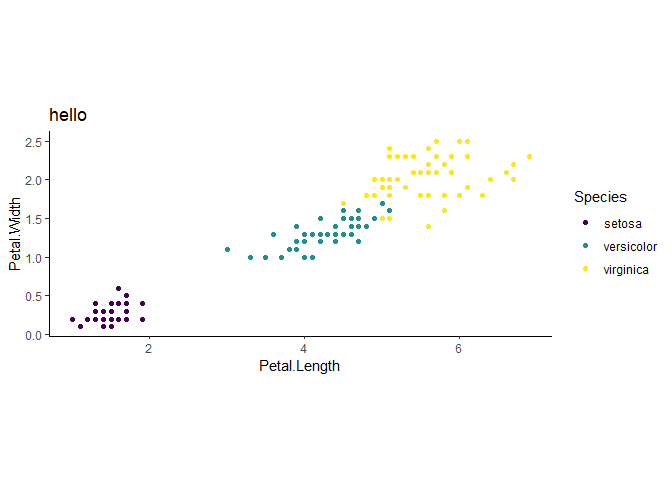
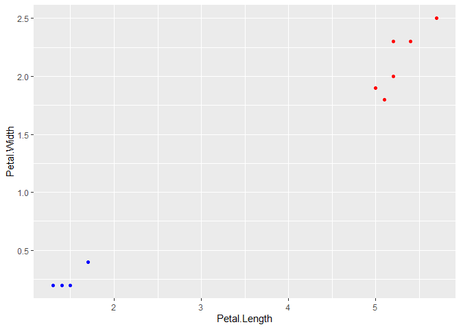

<!-- README.md is generated from README.Rmd. Please edit that file -->

# ggframe

*{ggframe}* is a *{ggplot2}* wrapper. A “ggframe” object is a data.frame
with a “layers” and an “aes” attributes. It has a printing method which
plots by default, but print with `plot = FALSE` and you’ll print the
data, aesthetics and layers.

You cannot do all you can do with *{ggplot2}*, it’s just an exploration
of some ideas. Unlikely to go much further.

Some nice things that you can do more easily than in native *{ggplot2}*
:

  - data wrangling on plot data (assuming you use functions that don’t
    drop attributes, it seems *{dplyr}* functions don’t, base R
    functions often do)
  - keep track of the steps that built the plot.

## Installation

Install with:

``` r
remotes::install_github("moodymudskipper/ggframe")
```

## Functions

`map_aes()` sets an `aes` attribute.

`geom()`, `facet()`, `set_labs`, `set_coord()`, `set_theme()`,
`set_scale()` and `set_guide()` are quick and dirty wrappers that add
the relevant plot building call to the `layer` attribute, I suppose a
more serious version of the package would provide a wrapper for all
relevant *{ggplot2}* functions, with explicit arguments rather than just
`...`. One advantage here is that it works with other packages extending
*{ggplot2}*.

`as_ggplot()` converts a ggframe object to a standard ggplot object.

## Examples

``` r
library(dplyr, warn.conflicts = FALSE)
library(ggplot2) # needs to be attached, geoms etc can come from other packages too
library(ggframe)

# fast to type for a quick plot 
iris %>%
  geom("point", aes(Petal.Length, Petal.Width, color = Species)) 
```


``` r

# defining default aes
iris %>%
  map_aes(Petal.Length, Petal.Width, color = Species) %>%
  geom("point") 
```


``` r

# wrangle the data after the layer definitions
iris %>%
  map_aes(Petal.Length, Petal.Width, color = Species) %>%
  geom("point") %>%
  filter(Species != "versicolor")
```


``` r

# print data, aesthetics and layers
iris %>%
  map_aes(Petal.Length, Petal.Width, color = Species) %>%
  geom("point") %>%
  slice_sample(n = 15) %>%
  print(plot = FALSE)
#> # A ggframe
#> # aes: x=Petal.Length, y=Petal.Width, color=Species
#> # layers:
#> # geom_point()
#> # A tibble: 15 x 5
#>    Sepal.Length Sepal.Width Petal.Length Petal.Width Species   
#>           <dbl>       <dbl>        <dbl>       <dbl> <fct>     
#>  1          7.4         2.8          6.1         1.9 virginica 
#>  2          5.7         2.8          4.1         1.3 versicolor
#>  3          5.8         2.8          5.1         2.4 virginica 
#>  4          5.7         4.4          1.5         0.4 setosa    
#>  5          7.9         3.8          6.4         2   virginica 
#>  6          5.2         4.1          1.5         0.1 setosa    
#>  7          5.4         3.7          1.5         0.2 setosa    
#>  8          5.5         2.5          4           1.3 versicolor
#>  9          6.9         3.1          5.1         2.3 virginica 
#> 10          4.8         3            1.4         0.3 setosa    
#> 11          5.9         3.2          4.8         1.8 versicolor
#> 12          5.8         2.6          4           1.2 versicolor
#> 13          5.6         2.8          4.9         2   virginica 
#> 14          6.3         3.3          4.7         1.6 versicolor
#> 15          6.4         2.7          5.3         1.9 virginica

# use set_* functions to leverage other features
iris %>%
  map_aes(Petal.Length, Petal.Width, color = Species) %>%
  geom("point") %>%
  set_coord("fixed") %>%
  set_theme("classic") %>%
  set_scale("color_viridis_d") %>%
  set_labs(title = "hello")
```



In *{ggplot2}* the `ggplot()` functions takes as optional arguments the
data and aesthetics to be inherited by further layers. It doesn’t link
explicitly aesthetics to a datasets (you can define aesthetics to be
inherited, but use a different dataset for every layer) but it’s quite
rare to start without a default data layer nor default aesthetics.

Moreover when providing custom data for a layer, in my experience we
generally don’t provide completely new data, but a transformation of the
main data. Indeed the `data` argument of geoms can be a function or
formula to be applied on the main data.

It works quite nicely here:

``` r
iris %>%
  map_aes(Petal.Length, Petal.Width) %>%
  geom("point", data = head, color = "blue") %>%
  geom("point", data = tail, color = "red")
```



Thanks to the fact that `ggplot2::ggplot_build()` is generic and called
by `layer_data()`, `layer_scales()` and `layer_grob()`, we could make
those work directly on ggframe objects :

``` r
# leverage layer_data easily
iris %>%
  map_aes(Petal.Length, Petal.Width) %>%
  geom("point", data = head, color = "blue") %>%
  geom("point", data = tail, color = "red") %>%
  layer_data(2)
#>     x   y PANEL group shape colour size fill alpha stroke
#> 1 5.7 2.5     1    -1    19    red  1.5   NA    NA    0.5
#> 2 5.2 2.3     1    -1    19    red  1.5   NA    NA    0.5
#> 3 5.0 1.9     1    -1    19    red  1.5   NA    NA    0.5
#> 4 5.2 2.0     1    -1    19    red  1.5   NA    NA    0.5
#> 5 5.4 2.3     1    -1    19    red  1.5   NA    NA    0.5
#> 6 5.1 1.8     1    -1    19    red  1.5   NA    NA    0.5
```
