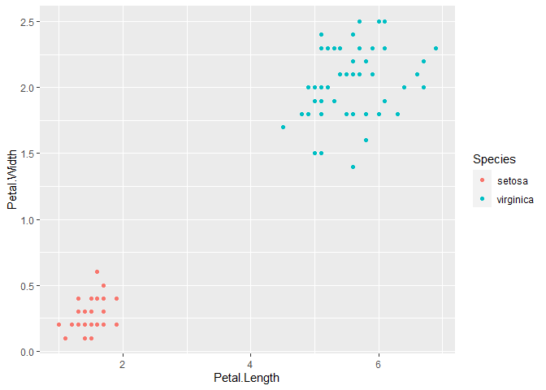

<!-- README.md is generated from README.Rmd. Please edit that file -->

# ggframe

*{ggframe}* is a *{ggplot2}* wrapper. A “ggframe” object is a data.frame
with a “layers” and an “aes” attributes. It has a printing method which
prints a plot by default.

You cannot do all you can do with *{ggplot2}*, it’s just an exploration
of some ideas. Unlikely to go much further.

Some nice things that you can do more easily than in native *{ggplot2}*
:

  - data wrangling on plot data (assuming you use functions that don’t
    destroy attributes, it seems *{dplyr}* function don’t, base R
    functions often do)
  - keep track of the steps that built the plot.

## Installation

You can install the released version of ggframe from
[CRAN](https://CRAN.R-project.org) with:

``` r
remotes::install_github("moodymudskipper/ggframe")
```

## Example

``` r
library(dplyr, warn.conflicts = FALSE)
library(ggplot2) # needs to be attached, geoms etc can come from other packages too
library(ggframe)

iris %>%
  map_aes(Petal.Length, Petal.Width, color = Species) %>%
  geom("point") 
```


``` r

iris %>%
  map_aes(Petal.Length, Petal.Width, color = Species) %>%
  geom("point") %>%
  filter(Species != "versicolor")
```


``` r

iris %>%
  map_aes(Petal.Length, Petal.Width, color = Species) %>%
  geom("point") %>%
  slice_sample(n = 15) %>%
  print(plot = FALSE)
#> # A ggframe
#> # aes: x=Petal.Length, y=Petal.Width, color=Species
#> # layers:
#> # geom_point()
#> # A tibble: 15 x 5
#>    Sepal.Length Sepal.Width Petal.Length Petal.Width Species   
#>           <dbl>       <dbl>        <dbl>       <dbl> <fct>     
#>  1          7.7         3.8          6.7         2.2 virginica 
#>  2          6.1         3            4.6         1.4 versicolor
#>  3          6.9         3.1          5.4         2.1 virginica 
#>  4          5.1         3.3          1.7         0.5 setosa    
#>  5          6.5         3            5.2         2   virginica 
#>  6          5.4         3.9          1.3         0.4 setosa    
#>  7          4.7         3.2          1.6         0.2 setosa    
#>  8          5.9         3            4.2         1.5 versicolor
#>  9          5           3.4          1.6         0.4 setosa    
#> 10          4.3         3            1.1         0.1 setosa    
#> 11          4.6         3.1          1.5         0.2 setosa    
#> 12          5.7         4.4          1.5         0.4 setosa    
#> 13          6.7         3.1          5.6         2.4 virginica 
#> 14          5           3.6          1.4         0.2 setosa    
#> 15          6.1         2.6          5.6         1.4 virginica


iris %>%
  map_aes(Petal.Length, Petal.Width, color = Species) %>%
  geom("point") %>%
  set_coord("fixed") %>%
  set_theme("classic") %>%
  set_scale("color_viridis_d")
```


